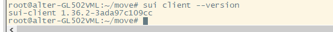
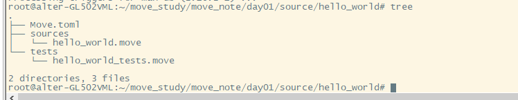
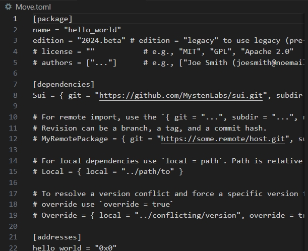
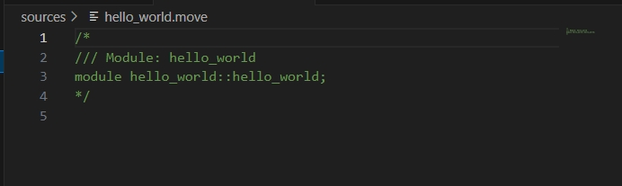
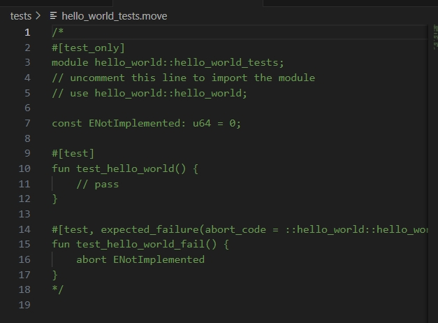
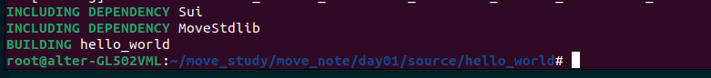

## 查看当前sui版本
sui client --version



## 创建新的包
sui move new hello_world



## 包清单文件
Move.toml是包清单文件，其中包含包的定义和配置设置，用于Move管理包的元数据、获取依赖项和注册命名地址。



## 资源文件夹

Sources文件夹用于存放源码文件，Move源码文件的拓展名以.move结尾，通常以模块名命名，例如我们这里的源码文件名字为hello_world.move，在文件生成时已经包含了move注释的代码。



“/* */”和 “//”是move用于块注释和行注释的语法。

## 测试文件夹
tests 文件夹用于包的测试，编译时这个文件夹的内容会被排处在外，但是在测试和开发模式中会构建，在代码中会用#[test]进行标记，可以单独放在一个模块中，通常命名为"包名::模块名_tests.move"。

在该目录下自动生成的文件hello_world_tests.move包含被注释的测试模板文件。



## 其他文件夹
除了上面介绍的文件夹Move Cli还支持examples文件夹那里的文件处理方式跟tests一样仅在测试环境和开发环境构建。

## 编译包
Move是一种编译型语言，所以需要将文件编译成字节码文件才可以运行，编译时只会包含运行程序所需要的内容，而不包含注释和一些标识符。

我们将hello_world.move文件替换为以下内容：
```
module hello_world::hello_world;
use std::string::String;

public fun hello_world(): String {
    b"Hello, World!".to_string()
}
```
使用sui move build 编译代码。



显示如上内容没有报错代表编译成功，编译过程中Move Compiler 会自动创建一个构建文件夹，其中放置所有获取和编译的依赖项以及当前包模块的字节码。

## 运行测试
在开始测试之前，我们需要添加一个测试代码，可以放在源文件和 tests/ 文件夹中。测试代码用 #[test] 属性标记，由编译器自动发现。
```
#[test_only]
module hello_world::hello_world_tests;

use hello_world::hello_world;

#[test]
fun test_hello_world() {
    assert!(hello_world::hello_world() == b"Hello, World!".to_string(), 0);
}
```

这里我们导入了 hello_world 模块，并调用其 hello_world 函数来测试输出是否是字符串“Hello, World!”。

使用命令`sui move test`测试hello_world::hello_world
```
sui move test
INCLUDING DEPENDENCY Sui
INCLUDING DEPENDENCY MoveStdlib
BUILDING hello_world
Running Move unit tests
[ PASS    ] hello_world::hello_world_tests::test_hello_world
Test result: OK. Total tests: 1; passed: 1; failed: 0
```
