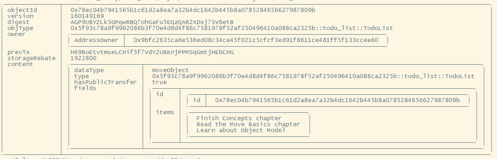

## 创建一个新的包
类似hello_world项目，我们新建一个包命名为todo_list。

`sui move new todo_list`

## 添加代码

用以下代码替换sources/todo_list.move文件的内容

```
/// Module: todo_list
module todo_list::todo_list;

use std::string::String;

/// List of todos. Can be managed by the owner and shared with others.
public struct TodoList has key, store {
    id: UID,
    items: vector<String>
}

/// Create a new todo list.
public fun new(ctx: &mut TxContext): TodoList {
    let list = TodoList {
        id: object::new(ctx),
        items: vector[]
    };

    (list)
}

/// Add a new todo item to the list.
public fun add(list: &mut TodoList, item: String) {
    list.items.push_back(item);
}

/// Remove a todo item from the list by index.
public fun remove(list: &mut TodoList, index: u64): String {
    list.items.remove(index)
}

/// Delete the list and the capability to manage it.
public fun delete(list: TodoList) {
    let TodoList { id, items: _ } = list;
    id.delete();
}

/// Get the number of items in the list.
public fun length(list: &TodoList): u64 {
    list.items.length()
}
```

## 编译包
`sui move build`
编译输出如下内容说明成功了，如果不成功就需要根据报错提示进行修改。
```
INCLUDING DEPENDENCY Sui
INCLUDING DEPENDENCY MoveStdlib
BUILDING todo_list
```

## 发布合约
要将包发布到网络，我们需要使用 sui client publish 命令。该命令将自动构建包并使用其字节码在单个事务中发布。

`sui client publish`

输出如下内容代表发布成功：
```
INCLUDING DEPENDENCY Sui
INCLUDING DEPENDENCY MoveStdlib
BUILDING todo_list
Successfully verified dependencies on-chain against source.
Transaction Digest: 6UuxtdiSaVMUmKcUP87vrfuBsSyLhKZarPnJDzLezB8z
```
可以看到最后一行的Transaction Digest这个是交易唯一标识符，通过这个标识符我们可以获取本次交互的状态信息。

## 交易数据
Transaction Data的部分包含有关我们刚刚发送的交易的信息。包含发送者（即您的地址）、--gas-budget 参数设置的 gas_budget 以及我们用于付款的 Coin 等字段。它还会打印运行的命令。在此示例中，Publish 和 TransferObjects 会运行。TransferObjects会在稍后给发送者转移一个特殊的对象UpgradeCap，用于合约升级。


## 交易影响
Transaction Effects包含交易的状态，交易对网络状态所做的改变以及交易涉及的对象。


## 事件
如果有任何事件发出，可以在这部分中看到它们。我们的包不使用事件，因此此部分为空。


## 对象变化

交易对对象所做的更改。在我们的例子中，我们创建了一个新的UpgradeCap 对象，这是一个特殊对象，允许发送者将来升级包，改变 Gas 对象，并发布一个新包。包也是 Sui 上的对象。


## 余额变化
最后一部分包含对 SUI 币的更改，在我们的例子中，我们花费了大约 0.001SUI，在 MIST 中是 8,275,480。您可以在输出中的金额字段下看到它。


## 可选输出
可以在发布时指定输出格式--json，这可以是结果以json形式输出，便于存储及编程使用。


## 合约调用
在合约发布以后，我们需要找到合约的pachage id，通过这个id我们可以与合约进行交互，它位于对象变化输出的已发布对象部分，例如这里我们的package id为
`0x5f93c78a9f9962086b3f70e4d8d4f86c7581978f52af250496410a088ca2325b`

现在我们有了地址就可以跟其进行交互了。

## 发送交易
为了演示与 todo_list 包的交互，我们将发送一个事务来创建一个新列表并向其中添加一个项目。事务通过 sui 客户端 ptb 命令发送，它允许充分利用事务块。该命令可能看起来很大而且很复杂，但我们会逐步介绍它。

## 准备工作
在构造命令之前，我们先把命令中需要使用到的长内容存储在变量中方便调用。将 0x5.... 替换为您发布的包的地址。然后 MY_ADDRESS 变量将自动从 CLI 输出设置为您的地址。

```
$ export PACKAGE_ID=0x5f93c78a9f9962086b3f70e4d8d4f86c7581978f52af250496410a088ca2325b
$ export MY_ADDRESS=$(sui client active-address)
```

## 构建交易
现在开始构建实际交易。交易将由两部分组成：我们将调用 todo_list 包中的 new 函数来创建新列表，然后将列表对象转移到我们的帐户。如下所示：

```
sui client ptb \
--gas-budget 100000000 \
--assign sender @$MY_ADDRESS \
--move-call $PACKAGE_ID::todo_list::new \
--assign list \
--transfer-objects "[list]" sender
```

在此命令中，我们使用 ptb 子命令来构建交易。其后的参数定义交易将执行的实际命令和操作。我们进行的头两个调用是实用程序调用，用于将发送方地址设置为命令输入并设置交易的 gas 预算。然后，我们实际调用包中的函数,使用 --move-call后跟包 ID、模块名称和函数名称。在本例中，我们调用 todo_list 包中的new函数。

命令执行完成后，我们能看到类似合约发布的输出内容，我们要关注的重点是，对象更改部分的内容，因为在后面的交互中我们需要用到合约创建的对象。

```
╭─────────────────────────────────────────────────────────────────────────────────────────────────────────╮
│ Object Changes                                                                                          │
├─────────────────────────────────────────────────────────────────────────────────────────────────────────┤
│ Created Objects:                                                                                        │
│  ┌──                                                                                                    │
│  │ ObjectID: 0x78ec04b7941565b1c61d2a8ea7a32b4dc1642b445b8a0785284656627987809b                         │
│  │ Sender: 0x9bfc2635ca6e536ed08c34ce45f021c5cfcf3ed91f8611ce481ff5f133ccee60                           │
│  │ Owner: Account Address ( 0x9bfc2635ca6e536ed08c34ce45f021c5cfcf3ed91f8611ce481ff5f133ccee60 )        │
│  │ ObjectType: 0x5f93c78a9f9962086b3f70e4d8d4f86c7581978f52af250496410a088ca2325b::todo_list::TodoList  │
│  │ Version: 160149167                                                                                   │
│  │ Digest: BT8cNNDmpxnmnRsmhdcw72YRehTLDDYXCXuKUWk1mL2r                                                 │
│  └──                                                                                                    │
│ Mutated Objects:                                                                                        │
│  ┌──                                                                                                    │
│  │ ObjectID: 0x9c03ac0cac0d130dac4086d1065ad92c3a57e098149f0b349e41de32eecf3d2d                         │
│  │ Sender: 0x9bfc2635ca6e536ed08c34ce45f021c5cfcf3ed91f8611ce481ff5f133ccee60                           │
│  │ Owner: Account Address ( 0x9bfc2635ca6e536ed08c34ce45f021c5cfcf3ed91f8611ce481ff5f133ccee60 )        │
│  │ ObjectType: 0x2::coin::Coin<0x2::sui::SUI>                                                           │
│  │ Version: 160149167                                                                                   │
│  │ Digest: HMm6Nd25Y75cTBrSvh2bj2mECDmmy2QfwWc2Q638qrFA                                                 │
│  └──                                                                                                    │
╰─────────────────────────────────────────────────────────────────────────────────────────────────────────╯
```

在这个例子中我们创建的TodoList对象id是`0x78ec04b7941565b1c61d2a8ea7a32b4dc1642b445b8a0785284656627987809b`

也可以通过命令`sui client objects`检查是否创建成功。


## 向函数传入对象
在上个步骤中我们成功创建了一个TodoList对象，下面我们将调用合约中的添加事务函数add，向对象中添加一个事务。

同样的我们先把对象存储在一个变量中方便我们调用。

`export LIST_ID=0x78ec04b7941565b1c61d2a8ea7a32b4dc1642b445b8a0785284656627987809b`

现在我们构造交易，向列表中添加项目。
```
sui client ptb \
--gas-budget 100000000 \
--move-call $PACKAGE_ID::todo_list::add @$LIST_ID "'Finish the Hello, Sui chapter'"
```

add方法需要传入2个参数，1个对象和1个项目名称，项目名称因为是字符串所以需要添加单引号，调用完成后我们可以使用命令`sui client object $LIST_ID`查看TodoList对象变化。


通过在命令后添加--json获取json格式化后数据

`sui client object $LIST_ID --json`

```
{
  "objectId": "0x78ec04b7941565b1c61d2a8ea7a32b4dc1642b445b8a0785284656627987809b",
  "version": "160149168",
  "digest": "8GWK1mEhVbPyHx46PVouGP9KEA95E47CKGJDxoniGej2",
  "type": "0x5f93c78a9f9962086b3f70e4d8d4f86c7581978f52af250496410a088ca2325b::todo_list::TodoList",
  "owner": {
    "AddressOwner": "0x9bfc2635ca6e536ed08c34ce45f021c5cfcf3ed91f8611ce481ff5f133ccee60"
  },
  "previousTransaction": "27fHXKJ6aj12KCSsR4qVEFcsen2cE8ij6vA2jNKXzvoU",
  "storageRebate": "1489600",
  "content": {
    "dataType": "moveObject",
    "type": "0x5f93c78a9f9962086b3f70e4d8d4f86c7581978f52af250496410a088ca2325b::todo_list::TodoList",
    "hasPublicTransfer": true,
    "fields": {
      "id": {
        "id": "0x78ec04b7941565b1c61d2a8ea7a32b4dc1642b445b8a0785284656627987809b"
      },
      "items": [
        "Hello sui first todo"
      ]
    }
  }
}
```

我们也可以在单个事务中添加多个命令：
```
sui client ptb \
--gas-budget 100000000 \
--move-call $PACKAGE_ID::todo_list::add @$LIST_ID "'Finish Concepts chapter'" \
--move-call $PACKAGE_ID::todo_list::add @$LIST_ID "'Read the Move Basics chapter'" \
--move-call $PACKAGE_ID::todo_list::add @$LIST_ID "'Learn about Object Model'" \
--move-call $PACKAGE_ID::todo_list::remove @$LIST_ID 0
```

在这个事务中，我们添加了3个新的事件，同时将之前添加的事件删除。



## 结语
事务中调用的并不仅局限于同一个，也可以是其他不同的包，在单个交易中可以同时与多个对象进行交互。